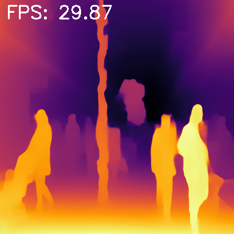

# Monocular-Depth-ViT-Optimization

| Original | FP32 | FP16 |
| :---: | :---: | :---: |
|  |  | |

## Performance & Accuracy Benchmarking

### Performance Comparison

| Metric | FP32 | FP16 | Delta |
| :--- | :--- | :--- | :--- |
| **Mean Latency** | 33.48 ms | 15.44 ms | -53.88% |
| **P50 Latency** | 33.13 ms | 15.42 ms | -53.46% |
| **P95 Latency** | 34.46 ms | 15.59 ms | -54.76% |
| **Throughput (FPS)** | 29.87 | 64.78 | +116.89% |

---

### Accuracy Analysis (FP32 vs. FP16)

| Metric | Value |
| :--- | :--- |
| **Mean Absolute Error (MAE)** | 0.5966 |
| **Max Error** | 5.4102 |
| **Relative Error** | 0.00065 |
